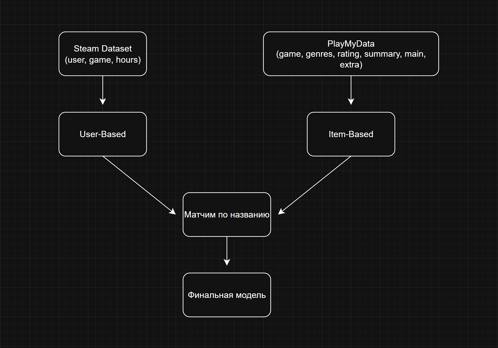

# Attuned

**Выполнил:** Паршин Даниил

---

## 1. Постановка задачи

Цель работы - анализ классических подходов для рекомендательных систем, для дальнейшей реализации рекомендательной системы по видеоиграм.

**Входные данные:**
- История игр пользователя (игры и количество часов)

**Выходные данные:**
- Ранжированный список игр, которые могут понравиться пользователю

**Ключевые требования:**
- Учитывать поведение похожих пользователей (коллаборативная фильтрация)
- Учитывать жанровую и контентную схожесть игр (контентная фильтрация)
- Уметь рекомендовать нишевые игры

---

## 2. Описание данных

### 2.1 Steam Dataset

| Поле       | Описание                                      |
|------------|-----------------------------------------------|
| `user_id`  | Идентификатор пользователя                    |
| `game`     | Название игры                                 |
| `behavior` | Тип действия: `purchase` или `play`           |
| `hours`    | Количество часов (для `play`, 1 = `purchase`) |

**Характеристики после первичной обработки:**

| Параметр                 | Значение |
|--------------------------|----------|
| Всего записей            | 200 000  |
| Записей `play`           | 70 489   |
| Уникальных пользователей | 11 350   |
| Уникальных игр           | 3 600    |
| Медиана часов            | 4.5 ч    |
| Максимум часов           | 11 754 ч |

Распределение часов игры имеет выраженный **long-tail** характер: большинство пользователей играют мало, единицы - тысячи часов. Поэтому выбрал логарифмическое масштабирование при переводе часов в рейтинг.

Рейтинг принимает значения от 1 до 10. Логарифм сглаживает влияние экстремально высоких значений.

### 2.2 PlayMyData

| Файл                        | Игр    |
|-----------------------------|--------|
| `all_games_PC.csv`          | 68 796 |
| `all_games_PlayStation.csv` | 24 040 |
| После дедупликации          | 85 056 |

| Поле            | Описание                               |
|-----------------|----------------------------------------|
| `genres`        | Список идентификаторов жанров          |
| `rating`        | Рейтинг IGDB (0 - 100)                 |
| `review_score`  | Пользовательская оценка (0 - 100)      |
| `main`          | Время прохождения основного сюжета (ч) |
| `extra`         | Время прохождения с доп. контентом (ч) |
| `completionist` | Время полного прохождения (ч)          |
| `summary`       | Текстовое описание игры                |

**Качество данных:**

| Фича                     | Заполненность |
|--------------------------|---------------|
| genres                   | 93%           |
| rating                   | 19%           |
| review_score             | 38%           |
| main/extra/completionist | 38%           |

Пропуски в числовых полях заполнялись медианным значением по всему датасету.

### 2.3 Пересечение датасетов

Прямое совпадение названий Steam - PlayMyData составило **828 игр** из 1053 Steam-игр (после фильтрации матрицы). Для расширения покрытия применялся **fuzzy matching** на основе алгоритма `token_sort_ratio` (библиотека `rapidfuzz`).

| Этап                        | Покрытие  |
|-----------------------------|-----------|
| Прямое совпадение           | 828 игр   |
| + Fuzzy matching (порог 93) | +407 игр  |
| Итого сидов                 | 1 235 игр |

Явные ложные срабатывания были добавлены в блэклист вручную.

---

## 3. Подход к реализации

### 3.1 Общая архитектура

### 3.2 Фильтрация матрицы

Для снижения разреженности user-item матрицы применялась двусторонняя фильтрация:

| Параметр             | Значение | Смысл                                 |
|----------------------|----------|---------------------------------------|
| `MIN_GAMES_PER_USER` | 3        | Пользователь сыграл хотя бы в 3 игры  |
| `MIN_USERS_PER_GAME` | 5        | В игру играло хотя бы 5 пользователей |

После фильтрации:
- Пользователей: 5 800
- Игр в матрице: 1 053
- Разреженность матрицы: 97%

**Известная проблема:** жёсткая фильтрация убирает нишевые игры из user-item матрицы. Решение - расширение пула кандидатов Item-Based на все 85к игр PlayMyData (см. п. 3.4).

### 3.3 User-Based

**Алгоритм:**
1. Вычисляем косинусное сходство между всеми пользователями по user-item матрице
2. Для целевого пользователя выбираем `n_neighbors` ближайших соседей
3. Для каждой несыгранной игры вычисляем взвешенную оценку

### 3.4 Item-Based

**Контентные признаки игры:**

| Группа   | Фичи                                             | Вес   |
|----------|--------------------------------------------------|-------|
| Жанры    | One-Hot по 23 жанрам                             | x 3.0 |
| Числовые | rating, review_score, main, extra, completionist | x 1.5 |

**Матрица сходства:**
- Строки: **все 85к игр PlayMyData** (кандидаты)
- Столбцы: **1235 Steam-игр** с фичами (сыгранные игры пользователя)
- Метрика: косинусное сходство

Такая структура позволяет рекомендовать нишевые игры из PlayMyData, которых нет в Steam-датасете.

**Алгоритм:**
1. Берём сыгранные игры пользователя, которые есть среди сидов (столбцов)
2. Для каждого кандидата оставляем только топ-`n_neighbors` сидов, остальные зануляем
3. Оставляем только кандидатов, похожих на >= `min_seeds` сидов выше порога `sim_threshold`
4. Финальный скор: `score = sum(sim x rating)` (без нормализации - игры похожие на больше сыгранных получают выше скор)

### 3.5 Гибридное объединение

Нормализуем скоры UB и IB в [0, 1], затем объединяем по трём зонам:

| Зона                | Формула                                   |
|---------------------|-------------------------------------------|
| Пересечение UB и IB | `(alpha x UB + beta x IB) x boost_factor` |
| Только UB           | `UB x discount_factor`                    |
| Только IB           | `IB x discount_factor`                    |

Идея: если игра попала в оба списка одновременно - это сигнал высокой уверенности, усиливаем её скор через `boost_factor`.

---

## 4. Демонстрация на конкретном примере

**Пользователь #5250**, сыгранные игры:

| Игра                     | Рейтинг (из часов) |
|--------------------------|--------------------|
| Cities Skylines          | 5.74               |
| Deus Ex Human Revolution | 4.93               |
| Portal 2                 | 3.51               |
| Alien Swarm              | 2.63               |
| Team Fortress 2          | 1.48               |
| Dota 2                   | 1.08               |

**User-Based рекомендации** (топ-5):
Игры, которые понравились пользователям с похожим профилем - преимущественно популярные тайтлы Steam-аудитории.

**Item-Based рекомендации** (топ-5):

| # | Игра                              | Почему                                             |
|---|-----------------------------------|----------------------------------------------------|
| 1 | Halo: The Master Chief Collection | Шутер, высокий рейтинг - близко к Alien Swarm, TF2 |
| 2 | Resident Evil 4                   | Шутер/Экшен - сходство с профилем                  |
| 3 | Half-Life 2                       | Классический Шутер - прямое попадание              |
| 4 | Counter-Strike                    | Схожий жанровый профиль                            |
| 5 | Doom Eternal                      | Шутер, высокий рейтинг                             |

**Гибридные рекомендации** объединяют оба списка: игры из пересечения усиливаются, остальные добавляются с дисконтом.

---

## 5. Гиперпараметры модели

### 5.1 User-Based

| Параметр             | Дефолт | Влияние                                                        |
|----------------------|--------|----------------------------------------------------------------|
| `n_neighbors`        | 20     | Больше соседей - сглаживание вкусов, меньше - точнее но шумнее |
| `MIN_GAMES_PER_USER` | 3      | Выше - плотнее матрица, но теряем новых пользователей          |
| `MIN_USERS_PER_GAME` | 5      | Выше - убираем нишевые игры из матрицы                         |

### 5.2 Item-Based

| Параметр         | Дефолт | Влияние                                                                         |
|------------------|--------|---------------------------------------------------------------------------------|
| `n_neighbors`    | 20     | Число сидов для каждого кандидата, меньше - точнее совпадение                   |
| `sim_threshold`  | 0.7    | Минимальное сходство с сидом, выше - строже фильтрация                          |
| `min_seeds`      | 2      | Кандидат должен быть похож на >= N сыгранных, выше - меньше случайных попаданий |
| `GENRE_WEIGHT`   | 3.0    | Вес жанров в векторе фич, выше - жанр важнее рейтинга                           |
| `NUMERIC_WEIGHT` | 1.5    | Вес числовых фич                                                                |

### 5.3 Гибридная модель

| Параметр          | Дефолт | Влияние                                    |
|-------------------|--------|--------------------------------------------|
| `alpha`           | 0.6    | Вес User-Based скора                       |
| `beta`            | 0.4    | Вес Item-Based скора                       |
| `boost_factor`    | 1.3    | Множитель для игр из пересечения UB и IB   |
| `discount_factor` | 0.8    | Множитель для игр только из одного подхода |

---

## 6. Метрики качества

### 6.1 Описание метрик

| Метрика   | Формула         | Смысл                                          |
|-----------|-----------------|------------------------------------------------|
| Precision | hits / K        | Доля релевантных среди топ-K рекомендаций      |
| Recall    | hits / relevant | Доля найденных релевантных из всех релевантных |
| Hit Rate  | 1 if hits > 0   | Хотя бы одна релевантная в топ-K               |

Оценка проводилась методом **hold-out**: для каждого пользователя скрывалось 20% его оценок (тестовая выборка), рекомендации строились по оставшимся 80%.

### 6.2 Результаты по итерациям

**Итерация 1** - базовая

| Модель     | Precision | Recall | Hit Rate |
|------------|-----------|--------|----------|
| User-Based | 0.0330    | 0.0898 | 0.30     |
| Item-Based | 0.0010    | 0.0025 | 0.01     |
| Hybrid     | 0.0250    | 0.0538 | 0.23     |

**Итерация 2** - после снижения порогов и fuzzy matching:

| Модель     | Precision | Recall | Hit Rate |
|------------|-----------|--------|----------|
| User-Based | 0.0360    | 0.0778 | 0.29     |
| Item-Based | 0.0061    | 0.0076 | 0.06     |
| Hybrid     | 0.0220    | 0.0569 | 0.22     |

**Итерация 3** - после расширения кандидатов на 85к:

| Модель     | Precision | Recall | Hit Rate |
|------------|-----------|--------|----------|
| User-Based | 0.0360    | 0.0778 | 0.29     |
| Item-Based | 0.0053    | 0.0069 | 0.05     |
| Hybrid     | 0.0170    | 0.0413 | 0.17     |

### 6.3 Подбор гиперпараметров гибридной модели

| alpha   | beta    | boost   | discount | Precision | Recall | Hit Rate  |
|---------|---------|---------|----------|-----------|--------|-----------|
| 0.7     | 0.3     | 1.2     | 0.7      | 0.0150    | 0.0435 | 0.130     |
| 0.6     | 0.4     | 1.3     | 0.8      | 0.0150    | 0.0192 | 0.120     |
| 0.5     | 0.5     | 1.5     | 0.9      | 0.0152    | 0.0390 | 0.141     |
| 0.4     | 0.6     | 1.3     | 0.8      | 0.0170    | 0.0400 | 0.160     |
| **0.8** | **0.2** | **1.3** | **0.7**  | 0.0230    | 0.0661 | **0.210** |
| 0.8     | 0.2     | 1.3     | 0.8      | 0.0170    | 0.0460 | 0.160     |

**Лучшая конфигурация по Hit Rate:** `alpha=0.8, beta=0.2, boost=1.3, discount=0.7`

---

## 7. Дополнительные исследования

### 7.1 Активные vs Неактивные пользователи

**Методология:**
- Отсортировали пользователей по количеству оценок в матрице
- **Активные (топ 10%):** пользователи с наибольшим числом оценок
- **Неактивные (нижние 10%):** пользователи с наименьшим числом оценок (но >= `MIN_GAMES_PER_USER`)
- Hold-out 20%, K=10, 100 пользователей из каждой группы

**Результаты:**

| Группа                  | Precision@10 | Recall@10 | Hit Rate@10 |
|-------------------------|--------------|-----------|-------------|
| Активные (топ 10%)      | 0.242        | 0.204     | 0.216       |
| Неактивные (нижние 10%) | 0.172        | 0.172     | 0.172       |

**Почему так:**
- У активных пользователей больше оценок - плотнее окружение соседей - точнее User-Based
- Больше сыгранных игр попадает в сиды - лучше работает Item-Based

**Вывод:** Система демонстрирует ожидаемое поведение - качество рекомендаций прямо пропорционально активности пользователя. Это мотивирует решение проблемы холодного старта (см. п. 7.2) и добавление механизмов онбординга в продукте.

---

### 7.2 Холодный старт

**Постановка проблемы:** Новый пользователь не имеет истории игр. Классические методы в этом случае не работают - нет данных для поиска соседей (User-Based) и нет сидов для расчёта сходства (Item-Based).

**Предлагаемое решение: Popularity + Content Bootstrapping**

Идея: просим пользователя выбрать 3 - 5 любимых игр из короткого списка (онбординг), и используем их как искусственные сиды для Item-Based.

**Этапы:**

1. **Скрываем все оценки пользователя** (симуляция холодного старта)
2. **Показываем пользователю топ-20 популярных игр** (по количеству игроков в Steam)
3. **Пользователь выбирает понравившиеся** - минимум 3 игры
4. **Запускаем Item-Based** только по выбранным играм

**Сравнение метрик: обычный режим vs холодный старт**

| Режим                     | Precision@10 | Recall@10 | Hit Rate@10 |
|---------------------------|--------------|-----------|-------------|
| Полная история (Hybrid)   | 0.0180       | 0.0438    | 0.1800      |
| Холодный старт (3 игры)   | 0.0032       | 0.0044    | 0.0638      |

**Вывод по холодному старту:** `precision` падает в 5.6 раз, `hit_rate` - в 2.8 раз. `recall` падает особенно сильно, поскольку при холодном старте тестовая выборка включает почти все игры юзера, а не 20% - задача значительно сложнее. Тем не менее `hit_rate` заметно лучше чем у случайного fallback, что подтверждает ценность пусть даже минимального онбординга.

---